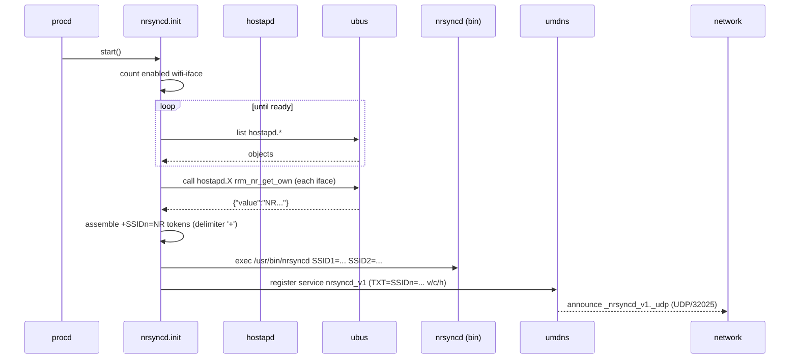

nrsyncd – 802.11k Neighbor Report Sync Daemon 🛜
======================================================

Distributes per‑BSS 802.11k Neighbor Report data across a set of OpenWrt APs using mDNS so clients (and higher‑level steering logic) can discover other BSSes of the same ESS quickly. Client support of 802.11k is required for full functionality and support varies by client device manufacturer and operating system.

For clients supporting 802.11k, this project provides a way to efficiently and automatically share neighbor report data across multiple access points, improving the overall performance and responsiveness of roaming between bands and BSSes.

> ⚠️ As this project is heavily reliant on OpenWrt's `ubus` and `hostapd` components, it is designed to work seamlessly within the OpenWrt ecosystem. However, the specific requirement for `ubus` inhibits the usage of this project in non-OpenWrt environments.

## Acknowledgements 🏅

Inspiration for this `nrsyncd` project comes from pioneering efforts by [Kiss Ádám](https://github.com/kissadamfkut) in the [openwrt-rrm-nr-distributor](https://github.com/simonyiszk/openwrt-rrm-nr-distributor) project. This project represents a significant evolution in the approach to 802.11k neighbor report synchronization as envisioned and established by Ádám in the former project beginning back in August 2021. Many thanks to Ádám for allowing this `nrsyncd` project to be spawned from [openwrt-rrm-nr-distributor](https://github.com/simonyiszk/openwrt-rrm-nr-distributor) and continue the growth and evolution of 802.11k neighbor reporting.

#### Provenance

*nrsyncd* is an extracted and renamed continuation of the refactored [“Neighbor Report Distributor” (rrm_nr) project](https://github.com/simonyiszk/openwrt-rrm-nr-distributor). It was released as *nrsyncd v1.0.0* under GPLv2 with permission. Legacy names are intentionally not retained.

## Features ✨

- Multi‑radio / multi‑band support (sequential `SSIDn=` TXT records)
- TXT metadata appended after SSID entries: `v=1`, `c=<count>`, `h=<8hex>` (extensible; safe for consumers to ignore unknown keys)
- Helps band / BSS steering by advertising sibling BSS information
- Works once `umdns` is functioning (no extra controller needed)
- Minimal logging (single tag `nrsyncd`) but enough to diagnose startup
- Deterministic neighbor list ordering (by SSID then BSSID) & duplicate suppression (remote duplicates collapsed)
- Per‑interface neighbor counts (post self‑filter) exposed as metrics
- Concise one‑line `summary` command (easy monitoring / telemetry)
- Metrics reset (`reset_metrics`) & on‑demand refresh (`refresh`)
- Baseline per‑SSID push guarantees initial hostapd population even with no diff
- Remote uniqueness tracking (cycle + cumulative) for observability of discovery breadth
 - Remote installer mode (stage & execute over SSH with a single command)
 - Optional sidechannel TXT advertisement (`sc=<proto>:<port>`) and listener for richer peer state exchange (extended mode)
 - Optional broadcast helper: proactive heartbeat/status JSON frames to discovered sidechannel peers (self-filtering, jittered)

## Architecture 🏗	️

Component | Purpose
----------|--------
`service/nrsyncd.init` | procd init script: gathers NR data via `ubus`, formats TXT args, registers mDNS service
`bin/nrsyncd` | Daemon script (POSIX shell) consuming positional `SSIDn=<value>` args
`lib/nrsyncd_common.sh` | Shared POSIX helpers (adaptive retry, iface mapping, millisecond sleep abstraction, probes)
`bin/nrsyncd_sidechannel` | Optional sidechannel listener (extended mode) writing last peer frame per id
`bin/nrsyncd_broadcast_helper` | Optional sidechannel heartbeat broadcaster (extended mode)
`examples/wireless.config` | Example `/etc/config/wireless` enabling 802.11k (`ieee80211k '1'`, `bss_transition '1'`)

### Data Flow Summary 🔀

1. Count enabled `wifi-iface` stanzas (skip those with `option disabled '1'`).
2. Wait until that many `hostapd.*` objects appear on `ubus` (ensures hostapd ready).
3. For each `hostapd.*`: call `ubus call <obj> rrm_nr_get_own` (method name unchanged) → JSON `{ "value": [bssid, ssid, hex] }`.
4. Assemble positional arguments per SSID as individual tokens using safe `set -- "$@" "SSIDn=<value>"` (no string delimiter or splitting). SSIDs are preserved literally, including spaces, `+`, and quotes.
5. Start daemon & register versioned mDNS service `nrsyncd_v1` (type `_nrsyncd_v1._udp`) on UDP/32025 with those TXT records (all `SSIDn=` first, then metadata `v/c/h`). Legacy `_rrm_nr._udp` is browsed only as a fallback for discovery.

### Startup Sequence (Mermaid) 🧜‍♀️



### Experimental: Activity Overlay (extended mode) 🧪

Background: `umdns` can’t mutate TXT records after registration, so core SSIDn= + metadata (`v/c/h`) remain static until the service is refreshed. To expose rapidly changing, derived “activity” signals without touching the positional SSID tokens, nrsyncd supports an optional “overlay” channel (requires `extended=1`):

- When the overlay is enabled (via `option activity_overlay '1'` and `extended=1`), protocol version bumps to `v=2` to signal the presence of new TXT keys after the core metadata. Two additional TXT keys may appear at the end (order preserved):
	- `a=` list of active SSID ordinals (e.g. `a=1,3`), or `<none>`
	- `i=` list of inactive SSID ordinals (e.g. `i=2`), or `<none>`
- The daemon computes and writes overlay tokens atomically to `/tmp/nrsyncd_overlay_tokens` each cycle. Consumers can ignore unknown TXT keys safely.


Overlay behavior:
- Requires `extended=1` and `option activity_overlay '1'`.
- Init seeds placeholders; daemon updates `/tmp/nrsyncd_overlay_tokens` with live ordinals.
- TXT ordering is preserved. Consumers should ignore unknown keys to remain forward-compatible.

Verification tips on device:
- Browse: `ubus call umdns browse | jsonfilter -l1 -e '@["_nrsyncd_v1._udp"][*].txt[*]'` (some builds need `[*]` twice). If parsing is flaky, fall back to `awk` on raw output.
- Packet-level: `tcpdump -n -i br-lan udp port 5353 and dst 224.0.0.251` and look for TXT strings including `a=`/`i=`.
- Bonjour: if available, `dns-sd -B _nrsyncd_v1._udp` then `dns-sd -L <Instance> _nrsyncd_v1._udp local` to dump TXT.

At rest (overlay disabled), TXT looks like:
```
SSID1=… SSID2=… v=1 c=2 h=deadbeef
```
With overlay enabled but no dynamic classification yet, placeholders are appended and `v=2`:
```
SSID1=… SSID2=… v=2 c=2 h=deadbeef a=<none> i=<none>
```

Notes and invariants:
- All `SSIDn=` tokens come first, followed by `v= c= h=` metadata, then any future keys (`a=`/`i=` today). Ordering and existing ordinals never change.
- Overlay tokens are derived from the stable ordinal map that the init script writes at startup; ordinals reflect the positional `SSIDn=` ordering.
- Overlay is independent of the optional sidechannel. See “Configuration” below for enabling overlay and the sidechannel.

### TXT Token Pruning (BusyBox umdns cap) ✂️

BusyBox `umdns` silently drops TXT records beyond an internal limit (empirically ~8). Optional features (overlay placeholders + sidechannel) can push the raw token count over this cap. To ensure discoverability of critical metadata while staying within the limit, `nrsyncd` applies a deterministic pruning policy at advertisement assembly time.

Composition examples (overlay placeholders shown as `<none>` when not yet populated):

Case | Components | Raw Count | Over Cap?
-----|------------|-----------|----------
Baseline (no overlay / sidechannel) | SSID1..N + v + c + h | N + 3 | Usually no
Overlay only | SSID1..N + v + c + h + a=<none> + i=<none> | N + 5 | 4 SSIDs => 9 (yes)
Overlay + sidechannel | SSID1..N + v + c + h + a=<none> + i=<none> + sc=proto:port | N + 6 | 3 SSIDs => 9 (yes)

Pruning priority (keep strongest first):
1. All `SSIDn=` tokens (never removed)
2. Core metadata: `v=`, `c=`, `h=`
3. Sidechannel token: `sc=` (retained unless all placeholders already removed and we still overflow)
4. Placeholder overlay tokens: prune `i=<none>` first, then `a=<none>`
5. (Future) Only if still over cap after removing placeholders may `sc=` be pruned

Worked examples (overlay + sidechannel enabled):
- 3 SSIDs → initial 9 tokens → prune `i=<none>` → final 8 (retain `a=<none>`, `sc=`)
- 4 SSIDs → initial 10 tokens → prune `i=<none>` then `a=<none>` → final 8 (retain `sc=`)

Operational notes:
- Pruning runs once in the init script when building the TXT argument vector; ordering of remaining tokens is preserved.
- A marker file `/tmp/nrsyncd_state/pruning` records which placeholder tokens were removed (`i`, `a`, optionally `sc`). Empty file means no pruning.
- Consumers seeing `v=2` without `a=`/`i=` should interpret absence as pruning (placeholders dropped), not as an error.

Test coverage (see `tests/`):
- `prune_three`: validates single placeholder pruning (3 SSIDs, drop `i=<none>` only).
- `prune_four`: validates dual placeholder pruning (4 SSIDs, drop `i=<none>`, then `a=<none>`).

Adding new TXT metadata: append only after existing keys and, if it can push counts above the cap, extend the pruning rules (favor pruning lowest-value, derivable tokens before capability indicators like `sc=`). Update this section and add a dedicated test scenario.

### SSID character handling and separators

`nrsyncd` preserves SSIDs exactly as reported by `hostapd`/`iwinfo`, including spaces (even repeated), plus signs (`+`), and embedded double quotes. To ensure robustness across these cases:

- The init script assembles each `SSIDn=` as its own positional argument; there is no string concatenation or custom delimiter.
- Inside the daemon, internal mappings use a TAB character as the field separator (not `|` or `+`) to avoid collisions with typical SSID contents.
- When emitting or parsing JSON, SSIDs are JSON-escaped (quotes/backslashes) so that neighbor lists and diagnostics remain valid JSON.

These changes mean SSIDs such as `My  SSID With  Spaces`, `Guest+Lab`, or `SSID "Quote" Test` are handled end-to-end without special-casing or data loss.

## Legacy Note 📜

A helper script `scripts/migrate_from_rrm_nr.sh` exists for older deployments but is not required for fresh installs.

Installer behavior with legacy rrm_nr:
- On a live system (no `--prefix`) if legacy `rrm_nr` config/service is detected and `/etc/config/nrsyncd` is not present, `scripts/install.sh` aborts to avoid a mixed state.
- To proceed, either run `sh scripts/migrate_from_rrm_nr.sh` first, or re-run the installer with `--auto-migrate-legacy` to migrate automatically.

### Upgrade from rrm_nr (Quick start) ⬆️

Follow these minimal steps on an existing device running the legacy rrm_nr service:

```sh
# 0) (Optional) stop legacy service before changes
[ -x /etc/init.d/rrm_nr ] && /etc/init.d/rrm_nr stop || true

# 1) Migrate config (safe, idempotent). This also disables the old service when possible.
sh scripts/migrate_from_rrm_nr.sh
# Or do it one-shot during install:
# sh scripts/install.sh --auto-migrate-legacy

# 2) Install nrsyncd (enables/starts service by default)
sh scripts/install.sh

# 3) Validate runtime and mDNS
logread | grep nrsyncd
/etc/init.d/nrsyncd status
ubus call umdns browse | jsonfilter -e '@["_nrsyncd_v1._udp"][*].txt[*]'
	# Tip: arrays in jsonfilter need [*]; omitting it often yields an empty []

# 4) (Recommended) Remove legacy artifacts after validation
sh scripts/migrate_from_rrm_nr.sh --remove-old --force

# 5) (Optional) Persist files across firmware upgrades
sh scripts/install.sh --add-sysupgrade --no-start
	# Adds runtime paths to /etc/sysupgrade.conf:
	#   /etc/init.d/nrsyncd
	#   /usr/bin/nrsyncd
	#   /lib/nrsyncd_common.sh
	# Note: /etc/config is persisted by OpenWrt by default, so /etc/config/nrsyncd is not added explicitly.
```

Notes:
- Remote installs also support migration via `--auto-migrate-legacy` (forward this flag with your remote run).
- The migration helper won’t modify your wireless config; ensure 802.11k/BSS transition are enabled per the example.

## Installation 💾

You have three progressively more automated options (plus a remote orchestration helper):

### 1. Quick Scripted Install (Local, Recommended) 👩‍💻

On the target OpenWrt device (copy the repo over or clone with git if available):

```sh
# assuming repository now at /tmp/nrsyncd_src (e.g. scp -r ./ root@ap:/tmp/nrsyncd_src )
cd /tmp/nrsyncd_src
sh scripts/install.sh
```

Options:
- `--no-start` only stage files (don’t enable/start service)
- `--force-config` overwrite existing `/etc/config/nrsyncd`
- `--add-sysupgrade` append required paths to `/etc/sysupgrade.conf` for persistence
- `--prefix /overlay` stage into another root (image build workflows)
 - `--deps-auto-yes` / `--deps-auto-no` non‑interactive dependency handling
 - `--install-optional` install high‑resolution sleep helper (coreutils-sleep or coreutils)
 - `--fix-wireless` auto-enable missing 802.11k / BSS transition options
 - `--auto-migrate-legacy` if legacy `rrm_nr` is detected on a live system, migrate it automatically instead of aborting
 - `--cleanup-legacy` after install, remove legacy `rrm_nr` init/bin/lib from the live system
 - `--cleanup-legacy-force` also remove legacy `/etc/config/rrm_nr` (implies `--cleanup-legacy`)

### Remote Install From Your Workstation 📡

Run the installer locally and have it stage + execute itself on one or more remote OpenWrt hosts over SSH (no manual scp required). The script:
1. Builds a minimal file set + a `sha256` manifest.
2. Streams a tar archive over SSH to each host (parallel sequentially, one after another).
3. Verifies integrity via `sha256sum -c` on the target (warns & skips verification if `sha256sum` absent).
4. Executes the same `install.sh` remotely with preserved non-remote flags.
5. Optionally cleans up the staging directory.

Examples:

```sh
# Basic (defaults to root user if user@ not provided)
sh scripts/install.sh --remote ap1

# Multiple hosts (comma or repeat) + auto dependency install + optional extras
sh scripts/install.sh --remote ap1,ap2,ap3 --deps-auto-yes --install-optional
sh scripts/install.sh --remote ap1 --remote ap2 --remote ap3 --force-config

# Remote with automatic legacy migration if detected on targets
sh scripts/install.sh --remote ap1,ap2 --auto-migrate-legacy

# Custom SSH port + force config + integrity check (automatic)
sh scripts/install.sh --remote ap1 --ssh-opts '-p 2222' --force-config

# Dry-run (prints plan, hashes, commands; makes no changes)
sh scripts/install.sh --remote ap1,ap2 --remote-dry-run

# Keep staging directory for inspection
sh scripts/install.sh --remote root@ap1 --remote-keep

# Alternate staging directory
sh scripts/install.sh --remote ap1 --remote-prefix /tmp/nrsyncd_stage_alt
```

Remote control flags (not forwarded to the target invocation):

Flag | Purpose | Default
-----|---------|--------
`--remote <host[,host2]>` | Enable remote mode for one or many hosts (comma or repeat) | (off)
`--remote-prefix <dir>` | Staging directory on target | `/tmp/nrsyncd_remote`
`--remote-keep` | Retain staging directory after success | (removed)
`--ssh-opts "..."` | Extra SSH options (port, identity, etc.) | (none)
`--remote-dry-run` | Show plan + hashes, exit without changes | (off)
`--remote-retries <n>` | Retry count per host (exponential backoff) | 1
`--remote-backoff <s>` | Base seconds for backoff (2,4,8...) | 2

All other standard flags (`--force-config`, `--no-start`, `--deps-auto-yes`, etc.) are preserved and applied on the remote side.

Notes:
- Requires `ssh` & `tar` locally and `tar` on the target (present on typical OpenWrt images).
- Integrity: Uses `sha256sum -c` on the target. If absent remotely, a warning is emitted and install proceeds (consider `opkg install coreutils-sha256sum`).
- Multi-host executes sequentially; failures on one host do not halt others (overall exit code reflects any failure).
- Retry logic: Each host retried up to `--remote-retries` times; delay sequence = base, base*2, base*4, ... using `--remote-backoff` as the starting seconds.
- Dry-run still generates a manifest locally then removes it (no remote connections made).
- Missing optional files are noted but not fatal.
 - Failures leave the staging directory intact for that host (unless missing connectivity precluded creation).
 - Legacy note: remote installs will also abort on legacy `rrm_nr` unless `--auto-migrate-legacy` is included; you can also add `--cleanup-legacy` or `--cleanup-legacy-force` to remove legacy files/config after install.
 - Duplicate hosts listed in `--remote` are de‑duplicated automatically (order preserved).

### 2. Manual Copy (Minimalistic) 📠

1. Ensure radios share a common ESSID where you want neighbor data propagated.
2. Enable 802.11k + BSS transition in each interface:
	- `option ieee80211k '1'`
	- `option bss_transition '1'`
3. Ensure `umdns` is installed & running (`opkg install umdns`).
4. Copy files:
	```sh
	cp service/nrsyncd.init /etc/init.d/nrsyncd
	cp bin/nrsyncd /usr/bin/nrsyncd
	cp lib/nrsyncd_common.sh /lib/nrsyncd_common.sh 2>/dev/null || true
	chmod +x /etc/init.d/nrsyncd /usr/bin/nrsyncd
	/etc/init.d/nrsyncd enable
	/etc/init.d/nrsyncd start
	```
5. Verify basic operation:
	```sh
	logread | grep nrsyncd
	ubus call umdns browse | grep SSID1=
	/etc/init.d/nrsyncd status
	```

### Post-Install Checklist ✅

- `logread | grep nrsyncd` shows a line "All wireless interfaces are initialized." followed by periodic update lines (if debug enabled).
- `ubus call umdns browse` contains TXT records `SSID1=...` etc.
- `/etc/init.d/nrsyncd status` shows current effective runtime values.
- `/etc/init.d/nrsyncd summary` prints concise counters & ratios.
- `/etc/init.d/nrsyncd reset_metrics` clears metrics & remote uniqueness (SIGUSR2).
- Install script warnings: if any `wifi-iface` lacks `ieee80211k '1'` or `bss_transition '1'` (and is not disabled) you will see a WARNING prompting you to enable them for proper neighbor reports.

### Quick Debug / Tuning Snippets ⚙️

Enable debug logging at runtime (no restart):
```sh
uci set nrsyncd.global.debug=1
uci commit nrsyncd
/etc/init.d/nrsyncd reload
```
Temporarily shorten update + jitter for lab testing (DON'T use in production extremely low values):
```sh
uci set nrsyncd.global.update_interval=15
uci set nrsyncd.global.jitter_max=3
uci commit nrsyncd; /etc/init.d/nrsyncd reload
```
Restore defaults:
```sh
uci delete nrsyncd.global.update_interval
uci delete nrsyncd.global.jitter_max
uci delete nrsyncd.global.debug
uci commit nrsyncd; /etc/init.d/nrsyncd reload
```

### Uninstall

```sh
/etc/init.d/nrsyncd stop
/etc/init.d/nrsyncd disable
rm -f /etc/init.d/nrsyncd /usr/bin/nrsyncd /lib/nrsyncd_common.sh
# Optional: remove config/state
rm -f /etc/config/nrsyncd /tmp/nrsyncd_runtime /tmp/nrsyncd_metrics
```

### ➕ Optional micro-sleep (usleep) dependency

The init script performs a short adaptive retry loop (200ms cadence, ≤1s total) when gathering initial `rrm_nr_get_own` values. On typical vanilla OpenWrt images `usleep` is NOT present (BusyBox `sleep` has 1s resolution). The script automatically detects this:

* If `usleep` exists (e.g. via `busybox-extras` or `coreutils-sleep`), it sleeps for true 200ms steps.
* If absent, it degrades to a single 1s sleep (effectively a one-shot retry). Elapsed accounting ensures we still bound total wait time.

Installing a micro-sleep implementation (optional):
```
opkg update
opkg install coreutils-sleep   # or a busybox providing usleep
```
This is purely an optimization; functionality still works without it, but initial readiness detection may be up to ~1s slower on hardware where readiness is actually ~0.2s.

## Configuration (UCI) 🔧

Config file `/etc/config/nrsyncd`:

```
config nrsyncd 'global'
	option enabled '1'                 # Set to 0 to disable service startup
	option update_interval '60'        # Seconds between update cycles (min 5 enforced)
	option jitter_max '10'             # Adds 0..jitter_max random seconds each cycle (capped at half interval)
	option debug '0'                   # Set to 1 for verbose debug logging (daemon.debug)
	option umdns_refresh_interval '30' # Minimum seconds between umdns update calls
	option umdns_settle_delay '0'      # Extra seconds to sleep immediately after an umdns update (default 0)
	# Advanced (optional) readiness tuning (normally leave defaults):
	# option quick_max_ms '2000'        # Max ms spent in first-pass adaptive readiness (cap 5000)
	# option second_pass_ms '800'       # Delay ms before second-pass fetch (cap 1500)

	# Skip specific interfaces (add one line per interface). Names are the part after 'hostapd.'
	# Duplicates and ordering are normalized automatically. Optional 'hostapd.' prefixes are stripped.
	# Examples:
	# list skip_iface 'wlan0'
	# list skip_iface 'wlan1-1'
	# list skip_iface 'hostapd.phy0-ap1'   # 'hostapd.' prefix accepted
	# To remove a previously added skip, delete its line and run: /etc/init.d/nrsyncd reload
	# Avoid blank lines like 'list skip_iface' with no value (they are ignored).

 	# list skip_iface 'phy0-ap1'
```

Optional overlay setting (extended mode):

```
config nrsyncd 'global'
	option activity_overlay '0'        # 1 = enable overlay TXT placeholders (v=2; appends a=<none>/i=<none>)
```

Operational behavior when enabled:
- With `activity_overlay=1`, the init script appends placeholder `a=<none>` and `i=<none>` tokens to the TXT on registration and seeds `/tmp/nrsyncd_overlay_tokens`.
- The daemon periodically updates `/tmp/nrsyncd_overlay_tokens` with `a=`/`i=` ordinals derived from recent activity and writes the ordinals into `/tmp/nrsyncd_runtime` for inspection.

- Ordering invariants for `SSIDn=` and metadata are always preserved; consumers can read `v/c/h` reliably regardless of overlay presence.


### Optional: tiny peer sidechannel (prototype; extended mode)

For richer, low-latency state exchange than TXT allows, nrsyncd can advertise and run a tiny opt-in sidechannel listener. Discovery remains mDNS-first; when enabled, a TXT token `sc=<proto>:<port>` is appended after the core metadata tokens so peers can discover how to talk directly. This feature requires `extended=1` and explicit enablement.

- Default: disabled; enabling does not change the core mDNS behavior.
- Listener: supervised by procd via `/usr/bin/nrsyncd_sidechannel` (shell stub; prefers `socat`, then `ncat`, then BusyBox `nc` if it supports required listen flags).
- Protocol: `udp` (default) or `tcp` on a configurable port (default `32026`).
- Security: optional pre-shared key (PSK) filter; messages are not encrypted. Use on trusted LANs and consider firewalling appropriately.

UCI options (all under `config nrsyncd 'global'`; requires `extended=1`):
- `option sidechannel_enable '0'` — set to `1` to enable
- `option sidechannel_port '32026'` — UDP/TCP port
- `option sidechannel_proto 'udp'` — `udp` or `tcp`
- `option sidechannel_psk ''` — optional PSK; when set, incoming JSON frames must contain `"psk":"<value>"`
- `option sidechannel_bind ''` — optional source bind address. The stub uses it only if supported by the local `nc`.

Dependencies and tooling:
- The sidechannel listener relies on a local listener tool. Current preference order: `socat` (per-datagram SYSTEM ingest), `ncat`, then BusyBox `nc` if it supports `-l/-p` (and `-u` for UDP).
- Many BusyBox `nc` builds on OpenWrt are client-only and do not support `-l`. If so, install one of:
	- `opkg install socat` (preferred)
	- or `opkg install nmap-ncat` (provides `ncat`)
- If none are available, the listener logs an explanatory message and disables receive until a suitable tool is installed.

Enable and verify (enable extended mode first):
```sh
uci set nrsyncd.global.extended=1
uci set nrsyncd.global.sidechannel_enable=1
# optional tweaks:
# uci set nrsyncd.global.sidechannel_proto='udp'   # or 'tcp'
# uci set nrsyncd.global.sidechannel_port='32026'
# uci set nrsyncd.global.sidechannel_psk='secret'
# uci set nrsyncd.global.sidechannel_bind='192.168.1.2'   # if your nc supports -s
uci commit nrsyncd
/etc/init.d/nrsyncd reload   # spawns sidechannel under procd when enabled

# Confirm TXT includes sc=proto:port
ubus call umdns browse | jsonfilter -l1 -e '@["_nrsyncd_v1._udp"][*].txt[*]' | grep '^sc='
```

Quick test (from another host; requires extended=1 and sidechannel enabled):
```sh
# UDP example without PSK
echo '{"id":"lab","hello":1}' | nc -u <ap-ip> 32026

# With PSK enabled in UCI, include the matching field:
echo '{"id":"lab","psk":"secret","hello":1}' | nc -u <ap-ip> 32026

# If nc is unavailable on the sender, you can also use socat:
printf '{"id":"lab","hello":1}\n' | socat - UDP-SENDTO:<ap-ip>:32026

# Inspect on the AP
ls -1 /tmp/nrsyncd_state/sidechannel_peers
cat /tmp/nrsyncd_state/sidechannel_peers/lab.json
```

Notes:
- Message schema is intentionally minimal for now: any single-line JSON is accepted; the stub extracts `id` (fallback `unknown`) and writes the last frame to `/tmp/nrsyncd_state/sidechannel_peers/<id>.json` (capped at 8KB).
- A lightweight heartbeat with the AP’s own `id` is written every 30 seconds.
- The `sidechannel_bind` option is best-effort: it’s used only if the installed `nc` supports `-s`. Prefer firewall rules to restrict reachability.

Live changes: Most runtime tunables (intervals, jitter, debug, umdns refresh, settle delay, skip_iface) can be reloaded without a full restart:

```sh
uci set nrsyncd.global.update_interval=45
uci commit nrsyncd
/etc/init.d/nrsyncd reload   # sends SIGHUP; daemon re-reads UCI values
```

Full restart still required only if you change structural aspects before daemon start (e.g. enabling/disabling service) or to clear internal state forcibly.

Environment mapping (init script → daemon) – new primary names with legacy (`RRM_NR_*`) still exported for backward compatibility in 1.0.x (deprecated 2025-10-01):
- `NRSYNCD_UPDATE_INTERVAL` → `UPDATE_INTERVAL`
- `NRSYNCD_JITTER_MAX` → `JITTER_MAX`
- `NRSYNCD_DEBUG` → enables debug log path
- `NRSYNCD_UMDNS_REFRESH_INTERVAL` → `UMDNS_REFRESH_INTERVAL`
- `NRSYNCD_QUICK_MAX_MS` → max milliseconds spent in first-pass adaptive iface readiness (default 2000, cap 5000)
- `NRSYNCD_SECOND_PASS_MS` → delay in milliseconds before the targeted second-pass fetch (default 800, cap 1500)

All options are optional; defaults are compiled into the script.

Numeric validation & bounds:
- update_interval: minimum 5 enforced (values <5 auto-raised to 5)
- jitter_max: capped to half of effective update_interval
- umdns_refresh_interval: minimum 5 enforced
- umdns_settle_delay: forced >=0 (negative coerced to 0)
Out-of-range values are sanitized silently; check `/etc/init.d/nrsyncd status` after reload for effective applied values.

### Deprecation Timeline ⏳

Legacy artifacts retained for a single transition window:

Item | Status in 1.0.0 | Deprecation Date | Action After Date
-----|-----------------|------------------|------------------
`RRM_NR_*` environment variables | Supported (alias to NRSYNCD_*) | 2025-10-01 | Will be removed in a minor release; update scripts to `NRSYNCD_*`.
`_rrm_nr._udp` mDNS browse fallback | Supported (fallback only) | 2025-10-01 | Removal planned; discovery must use `_nrsyncd_v1._udp`.
Unversioned `_nrsyncd._udp` | Never deployed | N/A | Do not rely on this name.

`rrm_nr_*` ubus method names remain indefinitely (tied to hostapd expectations) until upstream hostapd gains a native rename.

### Skipping Interfaces 🚫

Add one `list skip_iface '<iface>'` per interface (names are the portion after `hostapd.`). Example:

```
config nrsyncd 'global'
	list skip_iface 'wlan0'
	list skip_iface 'wlan1-1'
```

You may (optionally) include a `hostapd.` prefix; it will be stripped automatically (e.g. `hostapd.wlan0`).

Notes / behavior:
- Order and duplicates are normalized; the effective set is visible via `/etc/init.d/nrsyncd skiplist`.
- A blank `list skip_iface` without a value is ignored (no error); remove such lines to keep the config tidy.
- Changes take effect on `/etc/init.d/nrsyncd reload` (SIGHUP) without a full restart.

Skipped interfaces are omitted from TXT assembly and neighbor list updates.

On startup and reload, if any interfaces are skipped you'll see an additional log line:

```
Skip list: wlan0 wlan1-1
```

Note: The runtime status file still reports the environment variable as `skip_ifaces=` internally; this is only a naming artifact and maps to the configured `list skip_iface` entries.

### Service Commands 🛠️

Command | Purpose | Notes
--------|---------|------
`status` | Show runtime state + embedded metrics | Reads `/tmp/nrsyncd_runtime` & metrics snapshot
`summary` | One‑line health overview (push/suppress/cache/remote/neighbor stats) | Fast parse for scripts
`metrics` | Raw metrics file contents | For detailed monitoring ingestion
`mapping` | Live iface → BSSID / channel / width / center1 / SSID table | Uses iwinfo + ubus
`mapping_json` | JSON array variant of mapping | Alias: `mapping-json`
`neighbors` | Dump current per‑iface neighbor lists (JSON) | After self‑filter
`cache` | Show per‑SSID cached list files | Includes mtime + sample head
`refresh` | Force immediate update cycle (SIGUSR1) | No timing wait
`reset_metrics` | Reset counters & remote uniqueness (SIGUSR2) | Keeps cache/data intact
`diag` / `timing_check` | Readiness probe timings for each iface | Alias: `timing-check`
`skiplist` | Effective configured skip_iface entries | Normalized view
`version` | Init script version (and git hash if available) | Sync with release tag
`metadata` | Show parsed live mDNS TXT advertisement (SSIDn tokens + metadata v/c/h) | Useful to verify ordering and hash
`overlay` / `overlay_state` | Show overlay files (ordinal map + tokens) | Inspect `/tmp/nrsyncd_ordinal_map` and `/tmp/nrsyncd_overlay_tokens`

### Reloading Configuration ↻

`/etc/init.d/nrsyncd reload` triggers a SIGHUP which now:

1. Re-reads UCI for: update_interval, jitter_max, umdns_refresh_interval, umdns_settle_delay, debug, skip_iface.
2. Applies sanity caps (min 5s interval; jitter ≤ half interval; umdns refresh ≥5s).
3. Rebuilds interface→SSID mapping and reapplies skip list.
4. Logs a concise before→after summary (`Reload (SIGHUP): U=60 J=10 ... -> U=45 J=5 ...`). If any timing shrinks, the current sleep is interrupted for an immediate cycle.

Status:
```
/etc/init.d/nrsyncd status
```
Shows current effective runtime values (from `/tmp/nrsyncd_runtime`).

Next cycle uses the new timing immediately; current sleep is unaffected until next iteration (keeps logic simple and race‑free).

## Example Wireless Config Snippet 👨🏻‍🏫

See `examples/wireless.config` for a dual‑band setup. Key lines:
```
option ieee80211k '1'
option bss_transition '1'
option time_advertisement '2'
```

## Troubleshooting 🧑‍🔧

Symptom | Check
--------|------
Service never starts | `logread` for errors about missing `/etc/config/wireless` or zero interfaces.
Hangs at "Waiting for all wireless interfaces" | `ubus list hostapd.*` count vs enabled `wifi-iface` stanzas; ensure no disabled ones assumed active.
Missing TXT records | Confirm `umdns` running and firewall allows mDNS; inspect assembly by temporarily adding a `logger -t nrsyncd "$rrm_own"` before `procd_open_instance`.
Immediate restart with wpad restart | Likely ubus exit code 4 from `rrm_nr_get_own`; watch for upstream OpenWrt bug reference (see init script comment).

## Runtime Metrics 📊

Metrics are written to `/tmp/nrsyncd_metrics` each cycle (atomic rename). Fields:

Field | Meaning | Notes
------|---------|------
`cycle` | Number of update cycles completed | Increments once per full loop
`cache_hits` | Times a per-SSID group list matched existing cache | Diff done on whitespace-stripped JSON
`cache_misses` | Times a per-SSID list changed (or forced) and was rewritten | Includes forced writes from empty -> populated
`nr_sets_sent` | Per-interface neighbor lists actually pushed to hostapd | Baseline + subsequent changes
`nr_sets_suppressed` | Candidate per-interface updates skipped because list unchanged | Grows with stable environment
`remote_entries_merged` | Cumulative count of remote TXT lines ingested | Adds each cycle; not unique count
`remote_unique_cycle` | Distinct remote TXT entries observed in the most recent cycle | After per-cycle `sort -u`
`remote_unique_total` | Cumulative distinct remote TXT entries since daemon start | Backed by on-disk seen set
`last_update_time` | Epoch of most recent successful hostapd rrm_nr_set call | 0 until first push
`baseline_ssids` | Count of distinct SSIDs that received a baseline push this process | Ensures each SSID delivered once even if no diff
`suppression_ratio_pct` | Integer percent = suppressed / (sent+suppressed) * 100 | 0 when no updates yet
`nr_set_failures` | Count of failed `rrm_nr_set` ubus calls | Inspect logs if non‑zero; indicates hostapd rejection or transient ubus issues
`neighbor_count_<iface>` | Post self‑filter neighbor list size for interface `<iface>` | One dynamic key per active, non‑skipped interface

Interpretation tips:
- A high `suppression_ratio_pct` (e.g. >95%) indicates a stable environment (expected after convergence).
- `baseline_ssids` should equal the number of distinct SSIDs served locally (after a fresh start). If smaller, check logs for missing SSID mapping lines.
- `remote_entries_merged` will typically be (#remote TXT lines) * cycles; large growth alone is not an issue.
- If `nr_sets_sent` stalls at 0 while `cache_misses` increments, hostapd `rrm_nr_set` may be failing (enable debug and inspect logs).
- Non‑zero `nr_set_failures` warrants checking `logread -e nrsyncd` for rejection causes.
- `neighbor_count_<iface>` lets you quickly spot asymmetric visibility (e.g. one radio consistently sees fewer peers).

Ordering & Dedupe:
- Neighbor lists are now deterministically ordered by (SSID, BSSID) and duplicate SSID+BSSID pairs arriving from multiple remote sources are suppressed to a single entry.
- Per‑interface lists exclude that interface’s own BSSID triplet; counts reflect only true neighbors.

Example excerpt (with newer fields):
```
cycle=37
cache_hits=96
cache_misses=2
nr_sets_sent=3
nr_sets_suppressed=102
remote_entries_merged=111
remote_unique_cycle=3
remote_unique_total=7
last_update_time=1756609138
baseline_ssids=2
suppression_ratio_pct=97
nr_set_failures=0
neighbor_count_phy0-ap0=4
neighbor_count_phy0-ap1=3
neighbor_count_phy1-ap0=4
```

In this example two SSIDs had baseline delivery, three interfaces received initial lists, and subsequent interface-level opportunities were mostly suppressed (97% stability). Remote uniqueness indicates 7 distinct remote entries seen cumulatively, 3 present in the latest cycle.

### Summary Command ∑

`/etc/init.d/nrsyncd summary` prints a single concise line aggregating key counters, uniqueness and neighbor distribution stats. Example:

```
summary: cycles=37 pushes=3 suppressed=102 suppression=97% cache(hit/miss)=96/2 baseline_ssids=2 remote(entries=111 uniq_cycle=3 uniq_total=7) failures=0 neigh(min=3@phy0-ap1 max=4@phy0-ap0,phy1-ap0 avg=3 ifaces=3) last_update=1756609138
```

Field groups:
- `cycles` / `pushes` / `suppressed` / `suppression`: High suppression with low failures indicates convergence.
- `cache(hit/miss)`: Misses correspond to per‑SSID list mutations (or baseline). Persistent misses imply churn.
- `baseline_ssids`: Distinct SSIDs baseline‑delivered this process (should match local distinct SSIDs after first cycle).
- `remote(entries=E uniq_cycle=C uniq_total=T)`: Raw remote TXT lines merged, distinct in current cycle, and cumulative distinct since start (normalized).
- `failures`: Count of hostapd `rrm_nr_set` failures. Non‑zero warrants log inspection.
- `neigh(min=MIN@ifaces max=MAX@ifaces avg=AVG ifaces=N)`: Post self‑filter neighbor list sizes across active interfaces (min/max list the interface names; multiple if comma‑separated). Large disparity may indicate RF isolation or configuration differences.
- `last_update`: Epoch seconds for most recent successful neighbor list push.

Use the summary for quick health checks (automation, monitoring) without parsing the full metrics file.

## Security / Scope 🔐

- Read‑only interaction with hostapd via `ubus` (`rrm_nr_get_own`, `rrm_nr_set` to push lists). Does not modify wireless configuration.
- Writes ephemeral state only under `/tmp` (`/tmp/nrsyncd_state`, `/tmp/nrsyncd_metrics`, `/tmp/nrsyncd_runtime`); no persistent data besides optional config.
- mDNS exposure limited to TXT records enumerating encoded NR data; no management frames transmitted directly.
- No credentials or sensitive secrets handled; logging omits raw neighbor hex beyond what hostapd already provides.

## Versioning & Release 🚀

See `docs/CHANGELOG.md` for detailed history and `docs/DEVELOPER.md` for the full release checklist. Upgrade from pre‑rebrand versions generally requires replacing `service/nrsyncd.init` (formerly `service/rrm_nr.init`), `bin/nrsyncd` (formerly `bin/rrm_nr`), and `lib/nrsyncd_common.sh`, then restarting (`/etc/init.d/nrsyncd restart`). Baseline pushes will repopulate hostapd lists and metrics reset automatically. Legacy env vars are still exported for backward compatibility this release.

## Extending & Future Ideas 🌱

High‑level ideas (details and additional guidance in `docs/DEVELOPER.md`):

- Per‑interface opt‑out (planned) via `option nrsyncd_disable '1'`.
- Additional feature TXT flags appended after SSID arguments.
- Retry logic for non‑4 ubus failures (bounded, minimally noisy).

## Design Notes 📝

- Delimiter `+` is intentional (invalid in SSIDs) – do not change; consumers rely on ordered `SSIDn=` prefix positions.
- Minimal dependencies: BusyBox POSIX shell only (avoid `[[` and arrays). `jsonfilter` is assumed present on OpenWrt.
- Assumes hostapd exposes `rrm_nr_get_own`; if upstream API changes, a fallback probe sequence will be added.
- Adaptive readiness / retry algorithm & detailed assembly log line formats are documented in `docs/DEVELOPER.md` (see "Neighbor Assembly & Adaptive Retry").

### Persistence Across Upgrades (sysupgrade) 🆕

To keep files across firmware flashes, add these lines to `/etc/sysupgrade.conf` (or use `sh scripts/install.sh --add-sysupgrade`):
```
/etc/init.d/nrsyncd
/usr/bin/nrsyncd
/lib/nrsyncd_common.sh
# Optional sidecar (if installed):

```
Note: UCI configs in `/etc/config/*` (including `/etc/config/nrsyncd`) are already preserved by sysupgrade; no need to list them.

Manual addition:
```sh
for f in /etc/init.d/nrsyncd /usr/bin/nrsyncd /lib/nrsyncd_common.sh; do
	grep -qx "$f" /etc/sysupgrade.conf || echo "$f" >> /etc/sysupgrade.conf
done
```

Verify later:
```sh
grep nrsyncd /etc/sysupgrade.conf
```

### Installing Dependencies (opkg / apk) 📦

Runtime tools normally present: `ubus`, `jsonfilter`, `iwinfo`, `umdns`. If missing:

Using opkg (traditional):
```sh
opkg update
opkg install umdns jsonfilter iwinfo
```

Using apk (emerging images):
```sh
apk update
apk add umdns jsonfilter iwinfo
```

Optional high-resolution sleep:
```sh
opkg install coreutils-sleep   # or
apk add coreutils
```

### Optional: Sidechannel broadcast helper (experimental)

If you enable the sidechannel (extended mode), you can optionally run a tiny broadcaster that proactively sends a small heartbeat/status JSON frame to peers discovered via the `sc=` TXT token. This can help receivers learn about peers sooner without relying on them to initiate contact.

Enable (requires `extended=1` first):
```
uci set nrsyncd.global.extended=1
uci set nrsyncd.global.sidechannel_enable=1
uci set nrsyncd.global.sidechannel_broadcast_enable=1
# Optional tuning:
# uci set nrsyncd.global.sidechannel_broadcast_interval=60
# uci set nrsyncd.global.sidechannel_broadcast_jitter=10
# uci set nrsyncd.global.sidechannel_proto='udp'   # or 'tcp'; broadcaster inherits this
# uci set nrsyncd.global.sidechannel_psk='secret'  # included in payload if set
uci commit nrsyncd
/etc/init.d/nrsyncd restart
```

Notes:
- Discovery is still via mDNS; the helper extracts `sc=proto:port` from announcements + browse output (both scanned) and sends to up to ~50 peers per cycle. Duplicate entries (same host + proto:port) are automatically de‑duplicated.
- Backends used: `socat`, then `ncat`, then `nc` (best effort). If none are present, it logs a debug line and continues.
- Payload is minimal: `{ "id": "<hostname>", "ts": <epoch>, "kind": "hb", "psk": "..."? }`.
- Logging tag: `nrsyncd_sc_bcast`.
- Self-filtering: skips localhost entries, its own instance name, and any of its local IP addresses to avoid self-loop traffic.
- Discovery parsing: structured `jsonfilter` path first (browse then announcements) with a resilient fallback scanner. If both sources contain the same service, a single heartbeat is sent (dedup by host + proto:port). Instance names with spaces are preserved.

Test / debug environment toggles (not required in production):
- `NRSYNCD_SC_BCAST_DIRECT_INGEST=1` – deliver frames directly to the sidechannel ingest path (bypasses network send) while still performing full discovery & self‑filtering; used in tests.
- `NRSYNCD_SC_DISABLE_SELF_HEARTBEAT=1` – suppress the sidechannel daemon’s periodic self heartbeat file (simplifies certain test assertions).

## Limitations ⏸️

Summary (full discussion and future roadmap ideas in `docs/DEVELOPER.md`):
- Large deployments (>20 AP) may see slower convergence.
- Daemon is implemented as a POSIX shell script in this repository.
- Remote ingestion relies on mDNS reachability; packet loss can delay uniqueness visibility.
- Very large remote sets could inflate lists (future cap option contemplated).

## License 🪪

GPLv2 – see `LICENSE`.

## Quick One‑Liner (Elevator Pitch) 👨🏽‍💼

Collect each hostapd's 802.11k neighbor report and advertise them via mDNS TXT records so peer APs (same ESS) can rapidly share steering hints.

